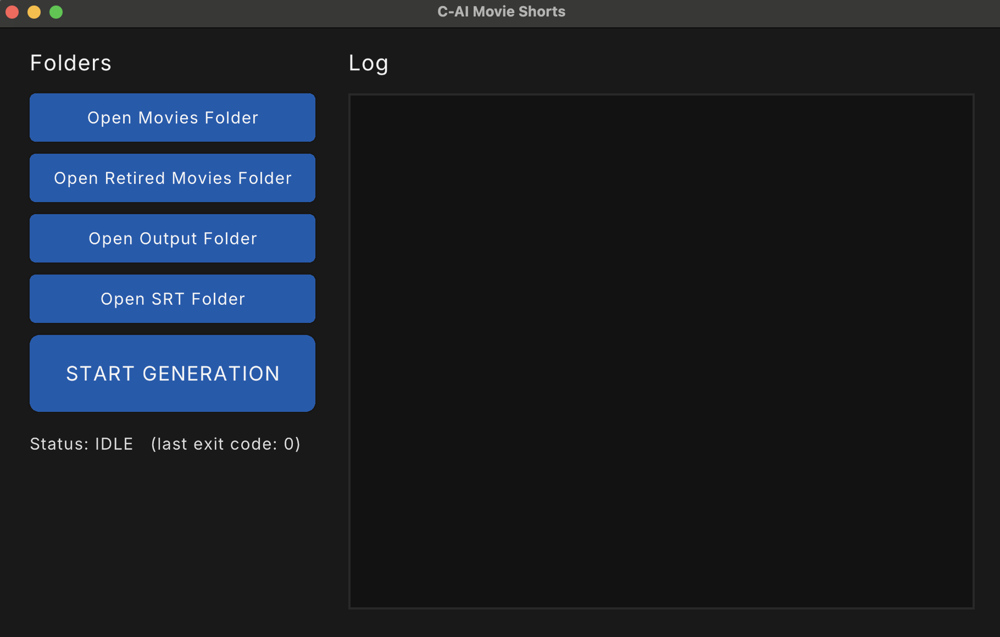

# AI-Movie-Shorts for Windows

Turn full-length `.mp4` movies into **AI-narrated movie recap videos** (horizontal + vertical), built automatically from subtitles + optional script context.

This is a **Windows port** of [keithhb33/AI-Movie-Shorts](https://github.com/keithhb33/AI-Movie-Shorts). It has the same features, UI, folder layout, `config.json` and pipeline, rebuilt so it works on Windows 10 and 11 without extra setup.

Example Video: [Citizen Kane (1941)](https://www.youtube.com/watch?v=ej8c0NwKW00&t=5s)



---

## Quick start (Windows 10 / 11)

**Using the ready-made zip (no compiler needed):**

```bat
run.bat web
```

That is the whole install. The first time you run it, `run.bat` notices that FFmpeg
is missing and **downloads and installs it for you** — portable, no admin rights,
nothing written to `C:\` and no system `PATH` change:

```
F:\AI-Movie-Shorts\tools\ffmpeg\bin\ffmpeg.exe
F:\AI-Movie-Shorts\tools\ffmpeg\bin\ffprobe.exe
```

Everything the app needs lives under `F:\AI-Movie-Shorts\tools`. Want it somewhere
else? Set `MOVIECAP_TOOLS` before running (e.g. `set MOVIECAP_TOOLS=F:\MovieTools`),
or pass `-ToolsDir` to `install_tools.ps1`. If there is no `F:` drive it falls back to
a `tools\` folder next to the app.

**Free narration instead of ElevenLabs:**

```bat
run.bat tts
```

Installs the free **Piper** engine (private Python + voice, all under
`F:\AI-Movie-Shorts\tools\piper`) and starts it on <http://127.0.0.1:5000>.
Then set *Narration engine* → **Piper** in the panel. No API key, no `C:` usage.
A bare `run.bat` installs Piper too, and when you press **Generate** the app
starts the Piper server by itself if it is not already running.

**Building from source:**

```powershell
# 1. one-time setup: installs CMake and the Visual Studio C compiler via winget
powershell -ExecutionPolicy Bypass -File .\setup.ps1

# 2. open a NEW terminal, then build
build.bat

# 3. add your API keys to config.json (or do it in the web panel), then start the app
run.bat web
```

`run.bat web` starts the **browser control panel** on <http://127.0.0.1:8080> — that is where you
set the API keys, drop movies in, watch the live log and preview the result.
(A bare `run.bat` only downloads/checks the tools, prints the confirmation and
stops — you open the app yourself; `run.bat cli` runs headless.)

Then put a movie in `movies\` (e.g. `movies\Citizen Kane.mp4`) and click **START GENERATION**.

> **No compiler?** Every push is built by GitHub Actions on Windows (see `.github/workflows/windows-build.yml`).
> Download the **AI-Movie-Shorts-Windows** zip from the latest run's *Artifacts* section. It contains the
> ready-to-run `.exe` files, `resources\`, `backgroundmusic\`, `config.json`, `run.bat` and
> `install_tools.ps1`. You do **not** need to install anything first — `run.bat` fetches a
> portable FFmpeg into `F:\AI-Movie-Shorts\tools` on first launch.

---

## What it does

Given a movie file, AI-Movie-Shorts will:

1. **Fetch subtitles (SRT)** automatically (and convert timestamps to seconds)
2. **Optionally fetch a script** (used only as extra story context)
3. Ask **OpenAI** (or any OpenAI-compatible / Anthropic-compatible endpoint, see
   *Notes & troubleshooting*) to generate a **clip plan** (timestamps + narration per clip).
   The prompt builds a character list from the subtitles first, keeps one name per character
   and forbids naming people who are not part of that clip's moment; the plan is sorted back
   into story order and overlaps are trimmed before any clip is cut
4. Generate voiceover audio for each clip (ElevenLabs by default, or a free
   local engine — XTTS / Piper / any OpenAI-compatible server)
5. Use **FFmpeg** to:
   - cut each clip
   - time-stretch video to match narration length (speed-up capped at 1.75×)
   - concatenate all clips into one recap video
6. Optionally add **background music** from `backgroundmusic\`
7. Export:
   - `output\<MovieTitle>.mp4` (standard)
   - `tiktok_output\<MovieTitle>_vertical.mp4` (9:16 vertical)
8. Move the source movie to `movies_retired\`

It also **clears generated files in `clips\` each run** (while preserving the `clips\audio\` folder and only removing files inside it).

---

## User interfaces

There are **three** ways to drive the pipeline — pick whichever fits:

| App | Start with | Best for |
|---|---|---|
| **Web control panel** (`movie_summary_web.exe`) | `run.bat web` → open <http://127.0.0.1:8080> | full control: settings, uploads, live progress, preview |
| **Desktop window** (`movie_summary_bot.exe`, raylib) | double-click `movie_summary_bot.exe` | quick one-button runs (needs OpenGL 3.3) |
| **Headless CLI** (`movie_summary_cli.exe`) | `run.bat cli` | servers, scheduled jobs |

### Web control panel (recommended)

```bat
run.bat web                       :: http://127.0.0.1:8080
run.bat web --port 9000           :: another port
run.bat web --host 0.0.0.0        :: reachable from other machines on your LAN
```

It is a small HTTP server with the whole UI embedded in the binary — no Node, no Python,
no browser extension, nothing to install. The page gives you:

- **START GENERATION** / **CANCEL** (the run stops at the next step boundary)
- a live **stage + progress bar** (movie 2 of 5 · clip 7 of 24 · "Narration (TTS)")
- a **live log** with colour-coded `[INFO] / [OK] / [WARN] / [FATAL] / [ffmpeg]` lines
- **every setting** in `config.json` editable in the form (API keys, models, voice,
  clip count, speed cap, music/narration volume, BGM on/off, vertical render on/off,
  auto-retire on/off, API base URLs) — keys are shown masked and are never echoed back
- **target recap length** (`recap_minutes`, minutes, 0 = automatic): the planner makes
  clip windows and narrations longer so the finished video lands near that length
- **burnt-in subtitles** (`captions`, on by default): the narration as small centred
  captions (~3.5% of frame height, thin outline) — readable, never huge. Each caption
  changes exactly when the voice moves on to the next sentence: the clip length is
  estimated per sentence (syllables, digits that are read out loud, punctuation pauses)
  and those boundaries are then snapped onto the real pauses `ffmpeg`'s `silencedetect`
  finds in the narration audio, so the text never runs ahead of the words or lags
  behind them. A two-line sentence is drawn **top line first** and the line length is
  sized to the middle 60% of the frame that the vertical (9:16) render keeps, so the
  Short does not cut the caption off at the sides. Chinese/Japanese/Korean captions get
  shorter lines (24 characters) and a system CJK font is picked automatically when
  `caption_font_zh` is empty
- **file management** for `movies\`, `scripts\srt_files\`, `backgroundmusic\`,
  `output\`, `tiktok_output\`, `movies_retired\`, `clips\`:
  drag-and-drop **upload**, **delete**, **download**
- **in-browser video preview** of the finished recaps (HTTP range requests, so seeking works)
- a health line showing whether `ffmpeg` / `ffprobe` are on PATH

Everything the page does is a plain HTTP call, so you can also script it:

| Endpoint | What it does |
|---|---|
| `GET  /` | the control panel page |
| `GET  /api/status` | running flag, exit code, stage/clip progress, folder counts, ffmpeg check (`?cfg=1` adds the settings) |
| `GET  /api/logs?since=<cursor>` | new log lines since the cursor |
| `GET  /api/list?dir=movies` | files in one of the known folders |
| `GET  /api/config` / `POST /api/config` | read / write `config.json` (keys masked, other keys preserved) |
| `POST /api/upload?dir=movies&name=Foo.mp4` | save a file (raw body) |
| `POST /api/delete` `{"dir":"movies","name":"Foo.mp4"}` | delete a file |
| `POST /api/generate` / `POST /api/cancel` | start / stop a run |
| `GET  /media/<dir>/<file>` | stream or download a file |

> The server has **no authentication** — it is meant for `127.0.0.1`. Only use
> `--host 0.0.0.0` on a network you trust.

### Desktop window (raylib)

The app (`movie_summary_bot.exe`) includes a simple **desktop UI window** (raylib) that lets you:

- Open key folders in **File Explorer** with one click:
  - `movies\`
  - `movies_retired\`
  - `output\`
  - `scripts\srt_files\` (subtitles/scripts cache)
- Start generation with a **START GENERATION** button, and stop it with **STOP**
- View generation output in an in-app **log panel**, including FFmpeg errors (it is also printed to the console window)
- The window is **resizable** (the log panel grows with it)

There is also a headless **`movie_summary_cli.exe`** that runs one generation pass in the terminal (`run.bat cli`).

### UI font
The UI uses **Inter Regular** from `resources\Inter-Regular.ttf`.

You can start the `.exe` from anywhere, including double-clicking `build\Release\movie_summary_bot.exe` in Explorer.
On startup it looks for the project folder (the folder that contains `resources\` / `config.json`) next to the
executable and in up to 5 parent folders, then switches to it.

---

## Folder structure

- `movies\` — input `.mp4` files (filename should be the movie title)
- `movies_retired\` — processed movies are moved here
- `output\` — final horizontal recap videos
- `tiktok_output\` — final vertical recap videos
- `backgroundmusic\` — optional `.mp3` / `.m4a` music used as BGM (10 tracks included)
- `clips\` — temporary working files (auto-cleared each run)
  - `clips\audio\` — generated narration MP3s (files cleared each run; folder preserved)
- `scripts\srt_files\` — downloaded/cached subtitles and optional scripts
- `resources\`
  - `Inter-Regular.ttf` — UI font
  - `ui.png` — UI screenshot (for README)
  - `app.ico`, `app.rc` — Windows icon + version info embedded into the `.exe`
- `src\` — C source (see *Source layout* below)
- `install_piper.ps1` — installs the free Piper narration engine (private Python + voice) into `F:\AI-Movie-Shorts\tools\piper`
- `install_tools.ps1` — portable FFmpeg downloader (called by `run.bat`; installs to `F:\AI-Movie-Shorts\tools`)
- `tools\mock_api_server.py` — offline stand-in for the OpenAI + ElevenLabs APIs
  and for the three free narration contracts (XTTS `/tts_to_audio/`, Piper
  `/synthesize`, OpenAI-compatible `/audio/speech`) — for testing
- `setup.ps1`, `build.bat`, `run.bat` — Windows helper scripts (all of them stay open so you can read the result)

The runtime folders are created automatically.

---

## Requirements

**Running the app** (the ready-made zip) needs nothing but FFmpeg, and `run.bat`
installs that for you — portable, into `F:\AI-Movie-Shorts\tools`, nothing on `C:`.
Double-clicking `run.bat` only performs this check/install and prints the result;
it never launches the app on its own.

**Building from source** additionally needs:

| What | Why | Install |
|---|---|---|
| **FFmpeg + ffprobe** | cutting / encoding / mixing | `run.bat setup` (portable, on `F:`) |
| **CMake ≥ 3.20** | build system | `setup.ps1` → `winget install Kitware.CMake` |
| **Visual Studio 2022/2026** or **Build Tools** with *Desktop development with C++*, **or** MinGW-w64 gcc | C compiler | `setup.ps1` installs Build Tools |
| Internet access during the first build | downloads the libraries | — |

`setup.ps1` installs the build tools for you and stays open at the end so you can
read the result. It uses the portable FFmpeg installer rather than
`winget install Gyan.FFmpeg`, so `C:` is left alone.

> Every helper script (`run.bat`, `build.bat`, `setup.ps1`) now ends with a pause,
> so double-clicking one shows you the outcome instead of flashing shut. If a
> window still closes instantly, open a terminal in the folder and run it from
> there — the full output stays on screen.

**You do NOT need** vcpkg, OpenSSL, Git, `curl.exe`, `unzip` or `pkg-config`. The build downloads and compiles
everything into one static `.exe`:

| Library | Used for | Notes |
|---|---|---|
| raylib 5.5 | UI | |
| libcurl 8.11 | HTTP | built with **Schannel**, the Windows TLS stack, so it uses the Windows certificate store |
| cJSON 1.7.18 | JSON | |
| miniz 3.0.2 | extracting subtitle `.zip` files | replaces the `unzip` tool |

---

## Config

Edit `config.json` in the project root (or use the **Settings** card in the web panel):

```json
{
  "open_api_key": "YOUR_OPENAI_KEY",
  "openai_model": "gpt-5.2",
  "openai_base_url": "https://api.openai.com/v1",

  "tts_provider": "elevenlabs",
  "elevenlabs_api_key": "YOUR_ELEVENLABS_KEY",
  "eleven_voice_id": "JBFqnCBsd6RMkjVDRZzb",
  "eleven_model_id": "eleven_multilingual_v2",
  "elevenlabs_base_url": "https://api.elevenlabs.io/v1",

  "tts_base_url": "",
  "tts_voice": "",
  "tts_language": "en",
  "tts_model": "tts-1",
  "tts_api_key": "",

  "use_wikipedia_plot": true,
  "wikipedia_base_url": "",
  "offline_planner": false,

  "min_clips": 20,
  "max_clips": 30,
  "max_video_speedup": 1.75,
  "narration_volume": 2.5,
  "bgm_volume": 0.1,
  "bgm_enabled": true,
  "make_vertical": true,
  "retire_movies": true
}
```

| Key | Default | Meaning |
|---|---|---|
| `open_api_key` | — (required) | OpenAI key. The run stops with a clear message while the placeholder is there |
| `openai_model` | `gpt-5.2` | model used for the clip plan |
| `openai_base_url` | `https://api.openai.com/v1` | swap for a proxy/gateway/mock that speaks the Responses API |
| `tts_provider` | `elevenlabs` | narration engine: `elevenlabs`, `xtts`, `piper` or `openai_tts` (see *Free narration*) |
| `elevenlabs_api_key` | — (required only when `tts_provider` is `elevenlabs`) | ElevenLabs key |
| `eleven_voice_id` | `JBFqnCBsd6RMkjVDRZzb` | ElevenLabs voice |
| `eleven_model_id` | `eleven_multilingual_v2` | ElevenLabs TTS model |
| `elevenlabs_base_url` | `https://api.elevenlabs.io/v1` | swap for a proxy/mock that speaks `/text-to-speech/<voice>` |
| `tts_base_url` | per engine | server URL for `xtts` / `piper` / `openai_tts` (defaults to `http://127.0.0.1:8020`, `http://127.0.0.1:5000`, `https://api.openai.com/v1`) |
| `tts_voice` | — | `xtts`: speaker file name · `piper`: voice id (optional) · `openai_tts`: voice name |
| `tts_language` | `en` | `xtts` only (`en`, `hi`, `ur`, `es`, `fr`, ...) |
| `tts_model` | `tts-1` | `openai_tts` only |
| `tts_api_key` | empty | optional bearer token for `openai_tts`; falls back to `open_api_key` |
| `min_clips` / `max_clips` | `20` / `30` | a random clip count in this range is requested per run (1-200) |
| `max_video_speedup` | `1.75` | cap for the video speed-up when the narration is short |
| `narration_volume` | `2.5` | narration gain when mixing |
| `bgm_volume` | `0.1` | background-music gain when mixing |
| `bgm_enabled` | `true` | set `false` for narration-only output |
| `make_vertical` | `true` | set `false` to skip the 9:16 render |
| `retire_movies` | `true` | set `false` to leave processed files in `movies\` |
| `use_wikipedia_plot` | `true` | download the movie's plot summary from Wikipedia and hand it to the model as the source of truth for character names (see *Character names*) |
| `wikipedia_base_url` | empty | override the API endpoint; empty picks `https://<language>.wikipedia.org/w/api.php` from the narration language |
| `offline_planner` | `false` | set `true` to keep the old fallback that narrates the **raw subtitle lines** when no AI plan arrives; by default such a movie is skipped with the reason in the log |

### Recap languages

`recap_languages` is the list of languages to render, one recap each, in order (max 4),
and the whole pipeline follows it: the subtitle file tag (`Toy Story.fr.srt`),
the Wikipedia subdomain, the narration language, the caption font and the Edge voice.
Chinese, Arabic, Spanish, French, German, Italian, Portuguese, Russian, Hindi, Urdu,
Japanese, Korean, Turkish, Indonesian, Dutch, Polish, Vietnamese and more are in the
language table; anything else falls back to English.

Two guards keep a language pass honest:

- the AI plan is checked for the requested language (writing system for Chinese,
  Japanese, Korean, Arabic, Persian, Urdu, Hebrew, Russian, Ukrainian, Greek, Hindi,
  Bengali, Tamil and Thai; function words for Spanish, French, German, Italian and
  Portuguese). A plan that comes back in the wrong language is rejected once and
  re-requested with an explicit "every narration must be in <language>" demand;
- the speech length of a plan is measured in the right unit (words, or characters
  for Chinese/Japanese/Korean/Thai) before it is compared with `recap_minutes`.

Each language writes its own output file (`Title.mp4`, `Title (Chinese).mp4`, ...), so
adding a language later only renders the missing one.

### Character names (Wikipedia plot summary)

The prompt already carries the two things the pipeline can fetch: the subtitles and, when
available, the movie script. Neither of them reliably states who is who, and a model asked to
recap a movie from memory regularly mixes names up, swaps two characters' roles, or invents a
name that nobody in the film has.

So the planner now also reads the film's **published plot summary**:

1. `w/api.php?action=query&list=search&srsearch=<Title> film` on Wikipedia,
   preferring a hit whose title carries a `(film)`/`(year film)` disambiguator.
2. `action=query&prop=extracts&explaintext=1` for that article,
3. the **Plot** section is cut out of the article (also accepted: *Plot summary*, *Synopsis*,
   *Plot synopsis*, *Story*, *Premise* — other sections such as *Cast* are dropped), capped at
   14000 characters,
4. cached as `scripts\srt_files\<Title>_plot.txt`, so reruns and retries do not hit Wikipedia again.

That text goes into the prompt as **INPUT C**, marked as the authority on names: every character
must be spelled exactly the way the summary spells it, and names may only fall back to the
subtitles/script knowledge when the summary does not mention that character. An extract shorter
than 400 usable characters is treated as "no plot found" and ignored.

Everything here is best effort and off the critical path — if Wikipedia is unreachable, or the film
has no article, the log says so and the run continues with the subtitles alone:

```
Plot summary: 2611 chars from Wikipedia (Heat (1995)) will be handed to the model so character names come from a reliable text.
Plot summary: the article "Some Obscure Film (2021 film)" has no usable plot section - continuing without it.
```

To fix a wrong or missing summary by hand, create the cache file yourself — it is read **before any
network call**, so a file of at least 400 characters is used exactly as written. (A shorter file is
treated as junk and replaced by a fresh download.)

```
scripts\srt_files\<MovieTitle>_plot.txt
```

Set `"use_wikipedia_plot": false` to skip all of this and go back to the model's own memory,
or point `"wikipedia_base_url"` at another MediaWiki API (a mirror, a proxy, a mock in tests).

Character names also drive the naming rules in the prompt itself: one fixed name per character,
a short introduction on first appearance, an explicit ban on inventing/merging/swapping names,
pronouns that can never point at two people, and no mention of a character who is not part of the
moment being narrated.

### When the AI plan fails

The narration must come from the model. If no usable clip plan arrives, the app **skips the
movie** and says why, because the only thing the offline fallback can do is read the subtitle
lines out loud - a recap that is really just the subtitles:

```
No AI clip plan for Heat - skipping this movie instead of turning the raw subtitle lines into the narration.
The messages above name the exact failure (API key, model id, base URL, quota, output limit).
```

Before giving up it retries in this order (each one is a single extra request):

1. without the IMSDb script, when the provider rejects the request size;
2. the provider's OpenAI-style `/chat/completions` endpoint, when an Anthropic-style
   `/anthropic` endpoint fails;
3. **bare JSON** - when the answer arrived but was not a usable clip plan (markdown fences,
   prose around the JSON, `"start": "120"` as text, a bare array, ...; all of those are
   accepted directly now as well);
4. a bigger output budget, when the provider says the reply stopped at `max_tokens`;
5. full-length narrations, when `recap_minutes` is set and the total speech came out far
   short of it.

Set `"offline_planner": true` if you prefer a raw-subtitle video over no video.

### Recap length (`recap_minutes`)

`"recap_minutes": 20` divides the target by the clip count and asks the model for that many
seconds of *speech* per clip (`20 min / 30 clips => 40 s per clip => about 90-125 words`).
The prompt says so twice (STEP 4 and STEP 5), and the run checks afterwards that the plan's
narrations really add up to the requested speaking time. If they do not, it asks the model
once more for full-length narrations, and then reports the truth:

```
Plan speech: about 6.9 min of narration for the 20 min target (30 clips).
The narrations are much shorter than the 20 minute target (6.9 min of speech) - asking the model once more for full-length narrations.
Recap length: 12.1 min of the 20 min target (60%).
```

The reason the number matters: each clip's video is sped up (at most `max_video_speedup`) to
fit its narration, so **the finished recap can never be longer than the narrations are** - a
short script shortens the video, it does not stretch.

### Free narration (no ElevenLabs key)

`tts_provider` swaps the narration engine without touching anything else in the
pipeline. Whatever audio comes back is converted to MP3 with FFmpeg when needed,
so clipping, concatenation and mixing behave exactly the same.

| `tts_provider` | Cost | What you run | Request |
|---|---|---|---|
| `elevenlabs` | paid (default) | nothing, it is the ElevenLabs cloud API | `POST {elevenlabs_base_url}/text-to-speech/{voice}` |
| `xtts` | **free** | `pip install xtts-api-server` then `python -m xtts_api_server` (port 8020) | `POST {tts_base_url}/tts_to_audio/` → WAV |
| `piper` | **free** | `run.bat tts` (installs a private Python + voice into `F:\AI-Movie-Shorts\tools\piper` and starts the server) | `POST {tts_base_url}/synthesize` → WAV |
| `openai_tts` | paid or free | OpenAI, or a local OpenAI-compatible server such as Kokoro-FastAPI | `POST {tts_base_url}/audio/speech` → MP3 |

Example — free XTTS narration with your own voice sample (drop a `.wav` in the
server's `speakers` folder and use its file name):

```json
{
  "tts_provider": "xtts",
  "tts_base_url": "http://127.0.0.1:8020",
  "tts_voice": "my_voice.wav",
  "tts_language": "en"
}
```

**Piper in one command** — no Python, no pip, nothing on `C:`:

```bat
run.bat tts
```

That downloads a private (embeddable) Python, `piper-tts[http]` and the
`en_US-lessac-medium` voice into `F:\AI-Movie-Shorts\tools\piper`, then starts the
server on <http://127.0.0.1:5000>. Keep the window open and set *Narration engine*
to **Piper** in the panel. Use `run.bat tts install` to install without starting it,
and `set PIPER_VOICE=en_US-amy-medium` for a different voice.

- With any provider other than `elevenlabs` the ElevenLabs key is **not**
  required, so a missing or placeholder `elevenlabs_api_key` no longer stops the run.
- If the local server is not reachable the clip is skipped with a
  `[WARN] XTTS TTS HTTP -1: no response` line instead of aborting the queue.
- The **Settings** card in the web panel has a *Narration engine* dropdown with
  the exact command to run for each engine.

Notes:
- Every optional key falls back to the default above when missing, so an old
  `config.json` keeps working.
- Numbers are clamped to sane ranges, so a typo cannot produce a 0-second recap.
- `openai_base_url` / `elevenlabs_base_url` are also how you test offline — see
  *Testing without API keys* below.

> `config.json` is committed with placeholders only. After you add real keys, run
> `git update-index --skip-worktree config.json` so you never commit them by accident.

---

## Build

### Easiest
```bat
build.bat          :: or: build.bat clean
```
This uses Visual Studio (MSVC) if it's installed, and otherwise MinGW gcc (with Ninja or MinGW Makefiles).

### Manual (Developer PowerShell / cmd)
```bat
cmake -S . -B build -A x64
cmake --build build --config Release
```
Outputs:
- `build\Release\movie_summary_bot.exe` — desktop UI
- `build\Release\movie_summary_web.exe` — web control panel
- `build\Release\movie_summary_cli.exe` — CLI

With MinGW: `cmake -S . -B build -G Ninja -DCMAKE_BUILD_TYPE=Release && cmake --build build` puts the executables in `build\`.

### CMake options
| Option | Default | Meaning |
|---|---|---|
| `BUILD_RAYLIB_UI` | ON | build `movie_summary_bot.exe` |
| `BUILD_WEB_UI` | ON | build `movie_summary_web.exe` (browser control panel) |
| `BUILD_CLI_APP` | ON | build `movie_summary_cli.exe` |
| `BUILD_SIMPLE_UI` | OFF | build the original's older light-theme UI (`src\ui_main.c`) |
| `BUILD_WINDOWS_GUI` | OFF | build the UI with no console window (logs are still shown in the in-app panel) |
| `USE_SYSTEM_CURL` | OFF on Windows | use an installed libcurl (e.g. vcpkg) instead of building it |

### Visual Studio IDE
Use *File → Open → Folder…* on this project. VS detects `CMakeLists.txt` automatically. Pick `movie_summary_bot.exe` as the startup item.

---

## Usage

1. Start the control panel: `run.bat web`, then open <http://127.0.0.1:8080>
2. Paste your OpenAI + ElevenLabs keys into **Settings** and press **SAVE SETTINGS**
3. Drop your movie into the **Movies** tab (or copy it into `movies\` yourself):
   - Example: `movies\Sinners.mp4`
4. Click **START GENERATION** and watch the stage / clip progress and the live log
5. When it finishes, play the recap straight from the **Output** tab
   (`CANCEL` stops the run at the next step boundary)

Prefer the desktop window? `run.bat` gives you the same start/stop/log with folder
buttons for `movies\`, `output\`, `scripts\srt_files\`.

Outputs:
- `output\Sinners.mp4`
- `tiktok_output\Sinners_vertical.mp4`

Movies that already have an `output\<Title>.mp4` are skipped.

---

## Background music behavior

If `backgroundmusic\` contains `.mp3` or `.m4a` files, the program will:
- randomly choose tracks (only tracks longer than 60 s),
- trim from ~40s in (to skip intros),
- stitch enough pieces to cover the recap duration,
- mix narration louder (×2.5) + BGM quieter (×0.1).

If no music files exist, output will be narration-only.

---

## Subtitles / script fetching

- Subtitles (SRT) are auto-downloaded (subf2m) when missing and extracted from the downloaded zip.
- The SRT is converted to a "seconds" file (`scripts\srt_files\<Title>_modified.srt`) that the planner reads.
  That file is **written in chronological order** — a subtitle track whose cues are out of order (merged
  tracks, per-CD files glued together) is sorted first and the log says so, because scrambled timestamps
  make the whole recap (clip ranges, narration and captions) come out in the wrong order. An already
  cached `_modified.srt` from an older run is re-converted automatically when its cues are not in order.
- The converted file is also **structured into sentences, not left as a stream of fragments**. Subtitle
  tracks are cut into whatever fits the screen ("Star." / "Command.", "I" / "can't" / "see the stars"),
  and handing that to the model is what makes a recap read like a rewritten subtitle list instead of a
  story. So consecutive cues are joined while the earlier one has no sentence ending yet, while the pause
  between them is short (under 1.5 s) and while the result stays a sane length — a merged cue keeps the
  window of everything it swallowed. A cue line that is only digits ("1944", "42") is kept as dialogue, a
  cue without milliseconds (`00:10:06 --> 00:10:08`) is kept, and a cached `_modified.srt` that is still
  a pile of 2-3 word fragments is rebuilt automatically.
- The plan is checked for the requested language: Chinese and Arabic by script, Spanish against the
  English function words. A plan that comes back in the wrong language is rejected once and
  re-requested with an explicit "every narration must be in <language>" demand.

- Script fetching (IMSDb) is **best effort** and **optional**. If it fails, the program continues with subtitles only.
  If OpenAI rejects the request because the script makes it too large, it automatically retries without the script.

If auto-fetch fails, you can manually add:
- `scripts\srt_files\<MovieTitle>.srt`

Then rerun.

---

## Vertical output

The vertical render:
- center-crops the movie to a narrower width,
- scales/pads to a 9:16 canvas,
- keeps audio if present.

Saved to `tiktok_output\`.

---

## What changed vs. the original (Windows port details)

| Area | Original (macOS/Linux focus) | This port |
|---|---|---|
| Running FFmpeg | `system()` / `popen()` through the shell | `CreateProcessW` directly, with no `cmd.exe`, so `&`, `%`, `^`, spaces and non-English characters in file names are safe. FFmpeg output goes to the UI log, and no console windows flash up |
| File names | narrow ANSI APIs (`fopen`, `FindFirstFileA`) | UTF-8 everywhere via wide Win32 APIs (`_wfopen`, `FindFirstFileW`, `MoveFileExW` …), so titles like `Amélie`, `千と千尋` and `Léon` work |
| UI compile on Windows | `main.c` included `<windows.h>` next to `raylib.h`, which fails to compile (`CloseWindow`, `DrawText`, `Rectangle` clash) | all Win32 code moved into `src\platform.c` |
| Unzipping subtitles | external `unzip` tool | built in (miniz) |
| libcurl | system package / pkg-config | built from source with Schannel |
| Downloads to file | `CURLOPT_WRITEFUNCTION = NULL` (crashes with a DLL libcurl on Windows) | explicit write callbacks |
| Replacing files | `rename()` (fails on Windows if the target exists) | `MoveFileExW(MOVEFILE_REPLACE_EXISTING)` |
| Fatal errors | `exit(1)`, which closes the whole UI window | the run is stopped, the error appears in the log, and the UI stays open (exit code −1) |
| ElevenLabs errors | JSON error saved as `.mp3` | HTTP status checked and the error message logged |
| BGM builder | could loop forever if no track was > 60 s | bounded retries |
| Filenames with `'` | broke FFmpeg concat lists | escaped properly |
| Working directory | had to be started from the project root | finds the project folder automatically |
| Console | — | UTF-8 console output, app icon + version info |
| Controlling a run | start only | **web control panel** + desktop **STOP** button: cancel at the next step boundary |
| Settings | hand-edit `config.json` | clip count, speed cap, volumes, BGM/vertical/retire toggles, the Wikipedia plot-summary switch, the raw-subtitle fallback switch and API base URLs are read from `config.json` and editable in the web panel |
| API keys in the panel | the key was echoed back with its first characters | only `****` plus the last four characters are shown |
| No usable AI plan | quietly narrated the raw subtitle lines | the movie is skipped with the reason in the log, unless `"offline_planner": true` |
| Clip-plan parsing | numbers only, `"clips"` only | also accepts `"start": "120"`, floats, a bare array, `[start, end, text]` triples and `text`/`voiceover` narration keys, and says which objects it dropped |
| Network errors | any transport failure (DNS/TLS/timeout) aborted the whole run with `exit(1)` | logged as a warning; the movie is skipped and the rest of the queue continues |
| URLs | raw titles pasted into subtitle/script URLs | percent-encoded, so `Amélie's Test (2001)` works |
| Testing | needs real API keys | `tools\mock_api_server.py` + the base-URL settings run the whole pipeline offline |

The pipeline is the same shape: clip counts (20–30), durations, speed cap, FFmpeg filters, BGM mixing
and vertical crop match the original. The recap prompt was rewritten (character list first, clip length
targets in seconds x 2.6 words, strict JSON), Wikipedia supplies the plot summary the names are
taken from, the plan is force-sorted chronologically, the
subtitle -> seconds conversion sorts out-of-order tracks, and caption changes are aligned to the
pauses of the generated narration instead of a character count (measured with real ffmpeg against
simulated TTS takes: worst caption change 0.04-0.05 s away from the moment the voice stops, against
0.15-0.56 s early and 0.63-1.17 s late before).

### Source layout
- `src\generator.c/.h` — the pipeline (subtitles → OpenAI → ElevenLabs → FFmpeg),
  plus the progress hook and the cancel flag the UIs use
- `src\platform.c/.h` — Windows layer (UTF-8 file system, processes, threads, Explorer), plus a POSIX fallback
- `src\web_ui.c` — web control panel: HTTP server + embedded page (`movie_summary_web`)
- `src\main.c` — raylib UI (`movie_summary_bot`)
- `src\cli.c` — CLI (`movie_summary_cli`)
- `src\ui_main.c` — the original's older simple UI (optional)
- `src\platform_open.c/.h` — kept for compatibility (opens folders)

It still builds on macOS/Linux (`cmake -S . -B build && cmake --build build`, using the system libcurl).

---

## Notes & troubleshooting

- **"Plot summary: Wikipedia has no article for ..."** → the recap is built from the subtitles alone. Check the exact title (a year helps: `Heat (1995)`), drop the summary in by hand at `scripts\srt_files\<MovieTitle>_plot.txt`, or turn the feature off with `"use_wikipedia_plot": false`.
- **Filename matters**: `movies\My Movie.mp4` → treated as title `My Movie`
- **"ffmpeg/ffprobe not found in PATH"** → start the app with `run.bat`; it installs a portable FFmpeg into `F:\AI-Movie-Shorts\tools\ffmpeg\bin` and puts it on PATH for that session. If the download is blocked, run `install_tools.ps1` yourself or `winget install Gyan.FFmpeg`, then **close and reopen** the app/terminal. Check with `ffmpeg -version`.
- **Windows SmartScreen** may warn about an unsigned `.exe` you built or downloaded. Click *More info → Run anyway*.
- **"The desktop window could not be opened: no usable OpenGL context"** (GLFW error
  `65543`, `WGL_ARB_create_context_profile is unavailable`) → the desktop UI needs
  OpenGL 3.3, which Remote Desktop sessions, VMs without GPU acceleration and old
  graphics drivers do not provide. Nothing is wrong with your videos: use
  **`run.bat web`** instead. The browser control panel has every control the desktop
  window has and needs no graphics card. Updating your graphics driver also fixes it.
  A bare `run.bat` only installs the tools and stops, so double-clicking it can
  never hit this error; open `movie_summary_web.exe` yourself for the panel.
- **No subtitles online?** When the subtitle download fails, the app now writes a
  fallback subtitle track (evenly spaced cues across the runtime) and continues.
  **No working OpenAI key?** The planner then falls back to a free local plan built
  from those cues, so generation still finishes with just FFmpeg + Piper. A real SRT
  placed at `scripts\srt_files\<Title>.srt` and/or a real OpenAI key still give the
  full-quality result.
- If you still see "No plan returned", check:
  - your OpenAI key (the exact error from OpenAI is shown in the log)
  - network connectivity
  - that the SRT conversion output is not empty
- **Claude / Anthropic-compatible endpoints** (any `openai_base_url` containing `anthropic`):
  - native Claude: `"openai_base_url": "https://api.anthropic.com/v1"` with an Anthropic key
    (`sk-ant-api...`) and a `claude-...` model. The key goes in the `x-api-key` header only —
    sent as a Bearer token instead, the API rejects it. All of these are accepted as the base URL:
    `https://api.anthropic.com/v1`, `https://api.anthropic.com`, a pasted
    `.../v1/messages` endpoint, with or without a trailing slash.
  - **the reply is streamed** (`"stream": true`). Anthropic refuses a *non-streaming* request
    whose `max_tokens` implies more than ~21,333 tokens of output ("Streaming is required for
    operations that may take longer than 10 minutes"), and a full clip plan needs more room than
    that — that is what made the Anthropic end look broken. The server-sent event stream is folded
    back into one reply object, so everything downstream (JSON repair, clip parsing, the
    "cut off at the output limit" retry) works exactly as before. A gateway that cannot stream
    answers HTTP 400, and that one request is retried non-streaming with a budget that fits
    (`max_tokens` 16000), so gateways keep working too.
  - gateways (DeepSeek `https://api.deepseek.com/anthropic`, Azure AI Foundry, ...) get the key in
    **both** headers and the model name is what the gateway expects.
  - the request adapts itself instead of silently dropping to the fallback planner: an output-token
    limit that is too high is retried with the limit named in the error (e.g. 32000 → 8192), a
    rejected `thinking` field is dropped and retried, and a reply that was cut off mid-JSON still
    yields the clip ranges that were complete. A reply that stopped at the provider's output limit
    (`stop_reason: max_tokens`, or `status: incomplete` / `finish_reason: length` on the OpenAI-style
    paths) is retried with a doubled budget (32000 → 64000) while the provider allows it, and the log
    says so instead of quietly shipping a half-length recap. `429` and `529`/`5xx` (rate limited /
    overloaded) are retried with a short backoff, which is what Anthropic asks clients to do.
    A model refusal (`stop_reason: refusal`) is reported as a refusal rather than as a broken plan.
  - the log prints what actually went out, so a failure can be read off it:
    `Anthropic-compatible endpoint: .../v1/messages (model=claude-..., max_tokens=32000, streamed)`.
    A key that is not `sk-ant-...` while the base URL is `api.anthropic.com`, or a model that is not
    a `claude-...` model on that host, is warned about *before* the request is spent.
  - `api.anthropic.com` is not retried on the OpenAI-style `/chat/completions` path (it does not
    exist there) — the log tells you instead. For gateways that path is derived from the Anthropic
    base URL with the pasted tail, `/v1` and `/anthropic` peeled off.
  - the OpenAI-style paths ask for a full plan too: `max_output_tokens` on the Responses API and
    `max_completion_tokens` on `/chat/completions` (dropped automatically for providers that only
    know `max_tokens`). If a reply still stops early, the log warns that only part of the clip plan
    arrived instead of quietly shipping a half-length recap.
  - DeepSeek's gateway maps `claude-*` model names to its own models, so a `claude-sonnet-...` model
    works against `https://api.deepseek.com/anthropic` too.
- **Batch planning (50% cheaper Claude runs)** — `"batch_planning": true` with an
  Anthropic-compatible `openai_base_url` (or the checkbox in the panel).  The recap you watch is
  identical; only the price and the waiting change:
  - the run happens in two passes. First it prepares every plan (**per movie and per language** —
    no "write English, then translate" shortcut, which would soften names and pacing), collects the
    requests and submits them as **one Anthropic Message Batch**. Then it waits for the batch and
    renders every video from those results.
  - each batched request is the *same* request a live run would send: same model, same system
    prompt, same subtitle text and plot summary. Only `stream` is left out, because the Batches API
    rejects it (the 10-minute streaming rule does not apply to an asynchronous batch). The output
    budget is deliberately generous (`max_tokens: 64000`, not the 32000 of a live request): a batch
    has no streaming limit and you are billed for the tokens actually produced, never for the cap -
    while a reply that comes back cut off would mean buying that plan a second time.
  - **nothing is ever paid for twice.** A batch that was submitted but not fetched yet is remembered
    in `scripts/plans/batch_state.json`; the next run fetches *that* batch instead of submitting a
    new one (results stay available for 29 days). A plan that is already on disk is never queued
    again, and a movie whose video already exists is not planned at all.
  - **quality is never traded away:** a plan that stopped at the output limit
    (`stop_reason: max_tokens`) is **submitted once more, as one more batch with twice the budget**
    (still 50% off) - only what is still cut off after that is re-asked **live** at the normal price
    (streamed, with the live retry ladder). An errored or expired request goes straight to the live
    retry, because there is no reply to re-ask about. The language check and the length audit run on
    batched plans exactly as on live ones, and a "write longer narrations" / "answer in <language>"
    correction always goes live. A plan that failed in the batch is remembered as failed, so it is
    not submitted a second time either.
  - `"batch_max_wait_minutes"` (default 720 = 12 h) caps the wait. When a batch is not finished by
    then, the run stops cleanly and the next run fetches the same batch — you are told the batch id.
  - batches are chunked at 100 requests / 32 MB, so a big queue is safe; each chunk is fetched before
    the next one is submitted. Set `"batch_planning": false` (default) for the normal live path.
- **Captions ahead of / behind the voice?** Caption changes are aligned to the pauses of the
  narration itself (`narration_pauses` + `align_boundaries_to_pauses` in `src/generator.c`), and the
  log says `Caption timing: N of M sentence boundaries aligned ...` plus the spoken range it used
  (e.g. `voice 0.60-19.15 s`). Two things to check in the log if it ever looks off:
  `No pauses could be found in the narration of this clip` (the portable ffmpeg is incomplete) and
  `Could not trim the silence at the edges of ...` (the narration keeps its lead-in, which shifts
  every caption of that clip).
- **Characters get mixed up / people who are not in the shot get named?** The recap prompt
  (`openai_make_plan` in `src/generator.c`) builds a character list from the subtitles first and is
  told never to guess or invent a name, to use one name per character everywhere and to only mention
  characters that are part of that clip's moment. Small/fast models ignore that far more often — the
  log warns when the configured model looks like a mini/small one. Use a strong model (e.g. `gpt-5.2`).
- **The clips play out of order?** The plan is sorted back into story order after every AI answer
  (and overlaps are trimmed), so an answer that lists the ranges in the wrong order can no longer
  produce a video that jumps around in time. The log says when that happened.
- If the UI font looks wrong: confirm `resources\Inter-Regular.ttf` exists (the log shows a warning if it's missing).
- If vertical render fails, confirm:
  - FFmpeg is installed and in PATH
  - the input `output\<MovieTitle>.mp4` exists and is valid
- "Could not move … to movies_retired" → the movie is open in another program (e.g. a video player).
- Antivirus software can slow FFmpeg down a lot. Consider excluding the project folder.
- Build errors about downloads → the first build needs internet access to download raylib, curl, cJSON and miniz.

---

## Testing without API keys

You can run the **entire** pipeline — plan, narration, clipping, concat, background
music, vertical render — without spending a cent, using the bundled mock API server:

```bash
# 1. start the fake OpenAI + ElevenLabs + Wikipedia endpoints, and the free-TTS ones
python tools/mock_api_server.py --openai-port 9100 --eleven-port 9101 --tts-port 8020 --wiki-port 9102
```

Then point `config.json` (or the Settings card) at them and start a run as usual:

```json
"openai_base_url":     "http://127.0.0.1:9100/v1",
"elevenlabs_base_url": "http://127.0.0.1:9101/v1",
"tts_base_url":        "http://127.0.0.1:8020",
"tts_voice":           "demo_speaker.wav",
"wikipedia_base_url":  "http://127.0.0.1:9102/w/api.php"
```

Port 8020 answers all three free-narration contracts at once, so setting
`"tts_provider"` to `xtts`, `piper` or `openai_tts` works against the same mock.
XTTS and Piper return WAV, which also exercises the MP3 conversion path.

The mock derives its clip timestamps from the subtitle text it is handed and returns
real MP3 tones of varying length, so the speed cap, the BGM builder and the FFmpeg
filters all get exercised. FFmpeg is still required.

Port 9102 answers the two Wikipedia calls with a fake article that has a real `== Plot ==`
section (and a `== Cast ==` section that must not leak into the prompt). The mock's clip
narration then repeats the character names it finds in *INPUT C*, and prints them:

```
[mock-openai] using character names from INPUT C: Mara Quinn, Axel Vance
```

If that line shows the names from the fake plot rather than nothing, the plot-summary path
works end to end without internet access.

## Legal

Only process videos you own or have permission to use. Subtitle/script sources may be unavailable for some titles, and availability can change over time.
